# Day 1 Lab Guide

## Container Core Concepts

> Duration: 120 minutes

### Table of Contents

[Exercise 1: Running Your First Container](#exercise-1-running-your-first-container)

[Exercise 2: Building custom container images using Dockerfiles: Node.js, NGINX, .NET 6](#exercise-2-building-custom-container-images-using-dockerfiles-nodejs-nginx-net-6)

[Exercise 3: Interaction with a Running Container](#exercise-3-interaction-with-a-running-container)  

[Exercise 4: Tagging](#exercise-4-tagging)  

[Exercise 5: Building and running SQL Server 2019 in a container](#exercise-5-building-and-running-sql-server-2019-in-a-container)
>Knowledge:Windows Containers

[Exercise 6: Working with Nano Server and Windows Server Core containers](#exercise-6-working-with-nano-server-and-windows-server-core-containers)

[Exercise 7: Build and run an IIS Server Image](#exercise-7-build-and-run-an-iis-server-image)

[Exercise 8: Building an ASP.NET 6 application](#exercise-8-building-an-aspnet-6-application)

### Prerequisites

The Virtual Machine is packaged with all of the required software to perform this lab.
  
The lab files are required to complete the hands-on exercises and have been pre-downloaded on the Virtual Machines.

### Exercise 1: Running Your First Container

In this exercise, you will launch a fully functional WordPress blog engine using a Linux-based Docker container. You will learn the commands needed to pull the container image and then launch the container using the Docker CLI. Finally, you will observe that by running the container, you don't need to install any of the WordPress dependencies onto your machine; the WordPress engine binaries and all dependencies will be packaged inside of the container.  

#### Running WordPress Blog Engine Container

[Return to list of exercises](#table-of-contents)

1. From your taskbar, click on the Windows Terminal icon to open **Windows Terminal**.

    

1. Type    `docker pull msftcontainers/wordpress`

    >Knowledge:This will tell Docker client to connect to public Docker Registry and download the latest version of the WordPress container image published by msftcontainers (hence the format msftcontainers/wordpress). The container image has been pre-downloaded for you on the VM to save you a few minutes, so you will see the Status message as **"Images is up to date for msftcontainers/wordpress:latest"**.

    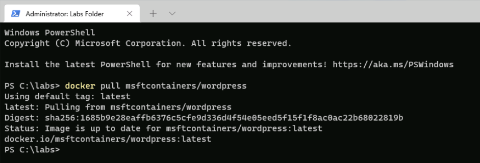

1. Run the command  

    `docker images`
    
    >Note:Notice "msftcontainers/wordpress" container image is now available locally for you to use.  

    

1. That's it! You can now run the entire WordPress in a container. To do that run the command  `docker run -d -p 80:80 msftcontainers/wordpress`  

    >Note: Pay close attention to the dash **"-"** symbol in front of **"-p"** and **"-d"** in the command.

    

1. Run the following `docker ps` to see the running containers.

    

1. Click on the **Microsoft Edge** browser icon in the taskbar:

    

1. Navigate to **http://localhost** and you should see WordPress.

    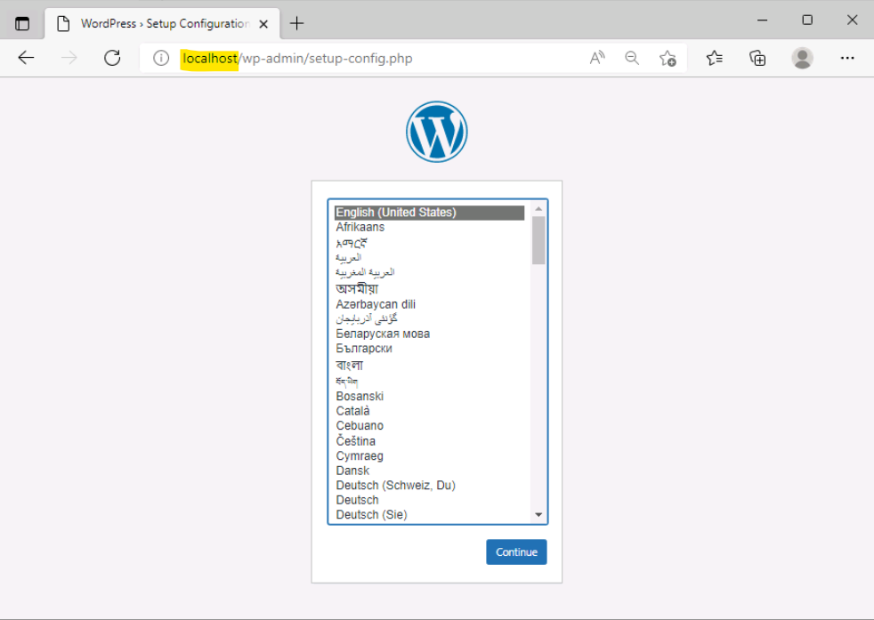

1. Let's launch two more containers based on "**msftcontainers/wordpress**" image. Execute following commands (one line at a time)

    
    `docker run -d -p 8080:80 msftcontainers/wordpress`
    
    `docker run -d -p 9090:80 msftcontainers/wordpress`

    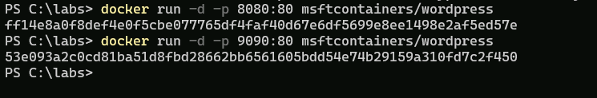

1. Run `docker ps` to see all 3 running containers and their port numbers:

    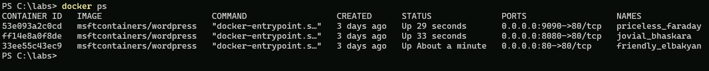

1. Now open a new browser window and navigate to URL (using DNS or IP as before) but with port "**8080**" append to it. You can also try port "**9090**". 
    
    >Note:Notice that you now have three WordPress blog instances running inside separate containers launched within few seconds. Contrast this to instead creating and running WordPress on virtual machine, which could take significantly more time.

    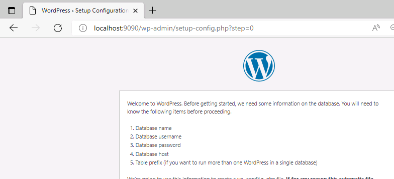

1. If you want to run a container with a name, you can specify the parameter like this:  

    `docker run \--name mycontainer1 -d -p 8081:80 msftcontainers/wordpress`   

    >Note:Run this on port **8081** so that it does not conflict with one of the previously running containers.

    

1. And, now if you run  `docker ps`, you will see that the container has the name you assigned it using the "**\--name parameter**".

    


>Knowledge:
Now, let's learn about common **Docker commands** needed to work with containers. 
To see a comprehensive list of docker commands available **[click here] (https://docs.docker.com/engine/reference/commandline/docker) **

1. First list all the containers currently running by executing `docker ps` command. You should see list of all running containers. 

    >Note:Notice, the list contains multiple containers based on WordPress image that you ran previously.

    

1. You can stop a running container by using **docker stop <CONTAINER_ID>**" command. Where **CONTAINER_ID** is the identifier of a running container. 
    
    >Note:You can just use the first couple characters to identity the container ID, such as "**1c1**" from the sample screenshot above, or you can use the full container ID.

1. Enter the first couple characters of one of the container ID in the textbox bellow.  Do not enter **1c1**, as your container ID will most likely start with a different characters.

    **Container ID**  
    

1. Type `docker stop <ContainerId1>` to stop the container with the ID that starts with **<ContainerId1> **

    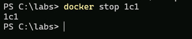

1. Now run the `docker ps` command and notice the listing show one less container running.

    

1. If you want see the Container ID of the stopped container, and you forgot the Container ID, you can run `docker ps -a` to see all containers, even those that are stopped/exited.

    

1. You can also issue command to **start** the container which was stopped. To start a container run `docker start <ContainerId1>`. 

    >Tip: This uses the container identifier you use in previous section to stop the container.

    )

1. To make sure that container has started successfully run `docker ps` command. 
    >Note:Notice that WordPress container is now started.

    

1. Stopping a container does not remove it and that's the reason why you were able to start it again in the previous task.

    To **delete/remove** a container and free the resources you need to issue a different command. Please note that this command does not remove the underlying image but rather the specific container that was based on the image. To remove the image and reclaim its resources, like disk space, you'll will need to issue a different command which is covered later.

1. To remove a container, run `docker rm -f <ContainerId1>` command.

    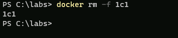

    >Note:The "**-f**" switch is used to **force** the remove operation. It's needed if you are trying to remove a container that is not already stopped.

1. To validate that container has been removed completely run `docker ps -a` command. 
    >Note:Note that container starting with the ID <ContainerId1> is not in the list.

    


1. At times you may want to stop all of the running containers and avoid issuing command to stop one container at a time. Run `docker stop $(docker ps -aq)` command to stop all running containers. Basically, you are issuing two commands: First the **docker ps** with relevant switches to capture list of container IDs and then passing list of IDs to **docker stop** command.

    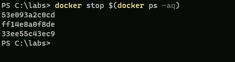

1. Now that we stopped all the containers, we can remove the image (**msftcontainers/wordpress**) used to run the containers.  Removing a container image form a local system will let you reclaim its disk space. 
    >Note:Please note that this operation is **irreversible** so proceed with caution. In this task you will remove the WordPress container image as you will not be using it any more. You must stop all containers using the image before you can delete the image, unless you use the force parameter.

1. To remove a container image, you'll need its IMAGE ID. Run command `docker images`
    
    

1. Enter the Image ID in the textbox bellow:
  
    

1. Run the command `docker rmi <ImageId1> -f` 

    >Note:Notice the command to remove docker container is "**docker rm**" and to remove an image is "**docker rmi**", with an 'i' for the image. Don't confuse these two commands! The **-f** is to force the removal, you cannot remove an image associated with a stopped container unless you use the force parameter.

    

1. Now, run the command `docker images` 

    >Note:Notice that "msftcontainers/wordpress" image is no longer available.

    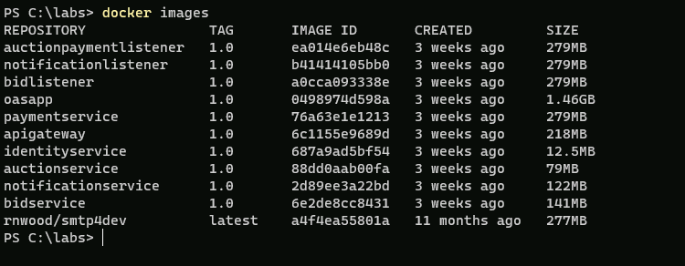

### Exercise 2: Building custom container images using Dockerfiles: Node.js, NGINX, .NET 6

A Dockerfile is essentially a plain text file with Docker commands in it that are used to create a new image. You can think of it as a configuration file with a set of instructions needed to assemble a new image. In this exercise, you will learn the common commands that go into Dockerfile by creating custom images based on common technologies like NGINX, Node JS and .NET.  

[Return to list of exercises](#table-of-contents)

#### Building and Running Node.JS Application as Container

In this task you will create a new image based on the Node.js base image. You will start with a Dockerfile with instructions to copy the files needed to host a custom Node.js application, install necessary software inside the image and expose ports to allow the traffic. Later, you will learn how to build the image using Dockerfile and finally will run and test it out.

>Note:The relevant files related to a node.js application along with the Dockerfile are available inside the directory "**labs/module4/nodejs**". 
    
1. From Windows Terminal navigate to the directory:

    `cd C:\labs\module4\nodejs`

    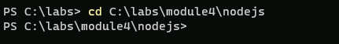

1. On the command prompt type `ls` and press **Enter**. 
    >Note:Notice the available files include "server.js", "package.json", "Dockerfile" and ".dockerignore".

    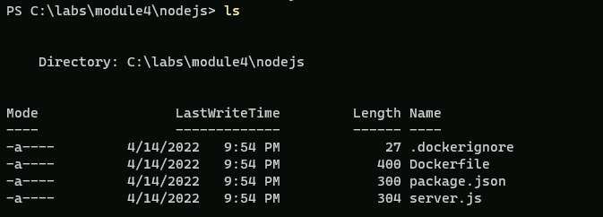

1. Let's examine the Dockerfile by typing the command `code Dockerfile` and press **Enter**.

    >Note: The file is case sensitive, so make sure the D in Dockerfile is capitalized.

    >Note: Dockerfile will open in Visual Studio Code for editing. Notice the structure of Dockerfile.

    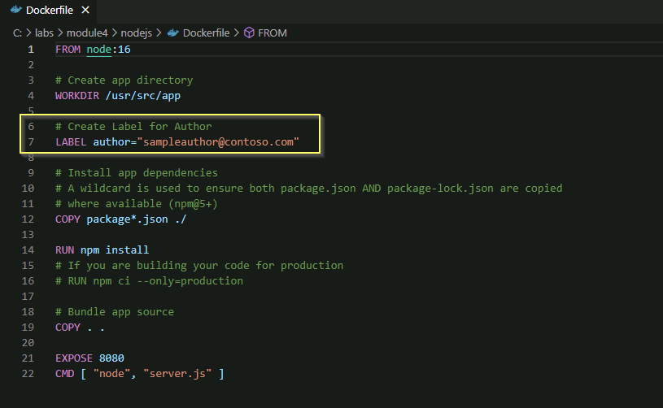

1. Find the line starting with **LABEL author="sampleauthor@contoso.com"** and change the email address to your own email. Once you finish making changes press save the file by pressing **CTRL+S**, and close the Visual Studio Code.

    You are now ready to build a new image based on the Dockerfile you just modified.

1. Run the command `docker build -t mynodejs .`

    >Alert:Pay close attention to the period that is at the end of command. 
    
    >Knowledge:Notice how the build command is reading instructions from the Dockerfile staring from the top and executing them one at a time. This will take a few minutes to pull the image down to your VM.

    

    >Alert:When it is complete, you might see a couple of npm warnings, you can ignore this.

1. Run the command 

    `docker images` 

    and notice the new container image appears with the name "**mynodejs**". Also notice the presence of parent image "**node**" that was also pulled from Docker Hub during the build operation (if you were using the provided lab machines, they may have already been cached locally).

   
1. Finally, lets create and run a new container based on "**mynodejs**" image. Run command  
    
    `docker run -d -p 8080:8080 mynodejs`  

    >Knowledge:The **-d** parameter will run the container in the background, whereas the **-p** parameter publishes the container port to the host. 
    
    >Note:Here, we are binding the port of the container (port number on right-side of colon) to the port of the host machine (port number on the left-side of the colon).

    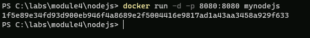

1. To test the "**mynodejs**" application, go back to your Microsoft Edge browser and go to **localhost:8080**.

    

### Building and Running NGINX Container

[Return to list of exercises](#table-of-contents)

In this task you will create a new image using the NGINX web server base image hosting a simple static html page. You will start with a Dockerfile with instructions to define its base image, then copy the static html file inside the image and then specify the startup command for the image (using CMD instruction). Later, you will learn how to build the image using Dockerfile and finally will run and test it out.

>Note: The relevant files including static html file **index.html** along with the Dockerfile are available inside the directory **labs/module4/nginx**. 

1. From Windows Terminal navigate to the directory:

    `cd C:\labs\module4\nginx`

    

1. Type `ls` and press **Enter**. Notice the available files include "**index.html**" and "**Dockerfile**".

    

1. Let's examine the Dockerfile by typing the command `code Dockerfile` and press **Enter**. 

    >Knowledge:You can use any other text editor, but instructions are provided for Visual Studio Code. 
    
    >Note:Notice the structure of Dockerfile.

    

1. Find the line starting with **LABEL author="sampleauthor@contoso.com"** and change the email address to your own email. Once you finish making changes press save the file by pressing **CTRL+S**, and close the Visual Studio Code.  

1. You are now ready to build a new container image based on the Dockerfile you just modified.  
    Run the command 
    
    `docker build -t mynginx .`

    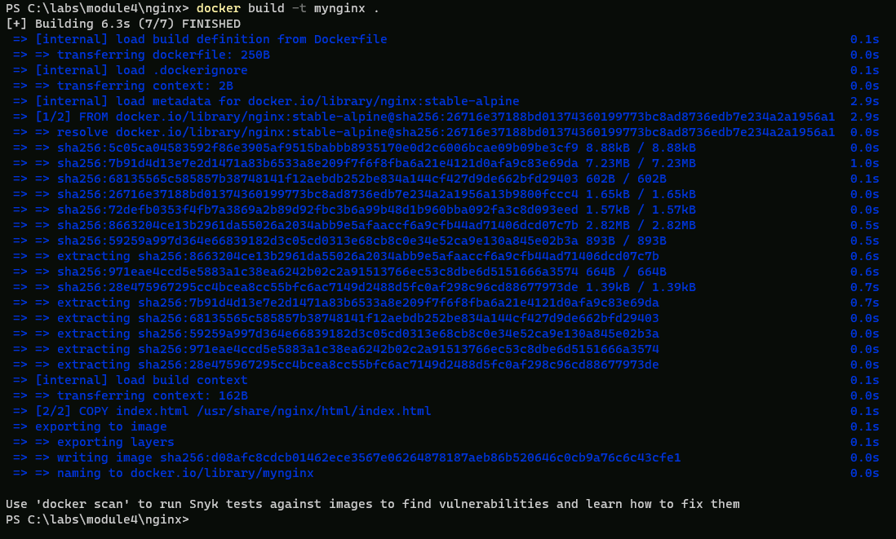  

    >Note:Notice how the build command is reading instructions from the Docker file starting from the top and executing them one at a time. The image will download much faster as this is a very small image.

1. If you want to see the layers of an image, you can do 

    `docker history mynginx`

    and see the one you just built. You can also try running this command on other images you have on your VM too.

    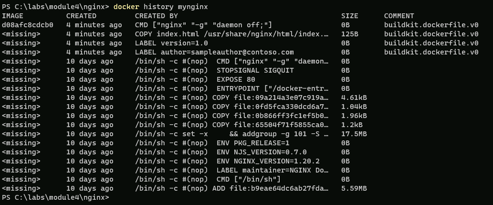
1. Run the command 

    `docker images`

    >Note:Notice the new container image appears with the name **mynginx**. Also notice the presence of parent image **nginx** that was pulled from Docker Hub during the build operation. Take a look at the sizes of different images also. This will become important when you build your own custom images to reduce the size for both security and performance.  

    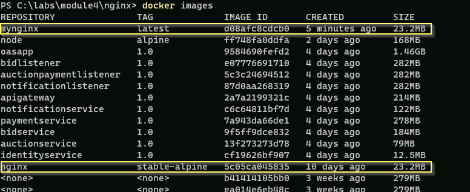

1. Finally, create and run a new container based on "**mynginx**" image. Run command 

    `docker run -d -p 80:80 mynginx`

    

1. To test the node app, go to your **Microsoft Edge** browser and go to **localhost**.

    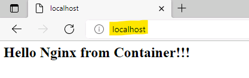

### Congratulations!

You have successfully completed this topic. Click **Next** to advance to the building ASP .NET Core Web Application.


# Building and Running ASP.NET Core Web Application inside of a Container 

[Return to list of exercises](#table-of-contents)

In this task you will build ASP .NET Core Web Application and then package and run it as a container. 


1. Change to the relevant directory 

    `cd C:\labs\module4\aspnetcore-linux`
    
1. First, we need to run **dotnet build**, and **publish** to generate the binaries for our application. This can be done manually or by leveraging a **Dockerfile**. In this example, we will run the commands manually to produce the artifacts in a folder called **published**. The **Dockerfile** will only contain instructions to copy the files from the **published** folder into the image.  Later on in the lab we will learn how we can take an advantage of multi-stage Dockerfiles to achieve the same result.

1. Run following commands to build and publish your .NET code

     `dotnet build`

     

     `dotnet publish -o published`

    

1. Now that the application is ready, you will create your container image. The Dockerfile is provided to you. View the content of Dockerfile by running the following command:

    `code Dockerfile`

    >Note:The Dockerfile contents should match the screenshot below:  

    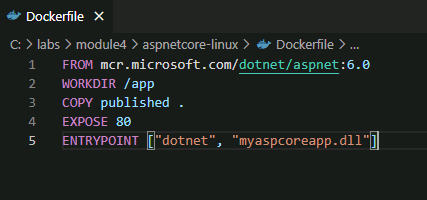 
    
    >Note: After reviewing a file, you can close Visual Studio Code.

1. To create the container image run the command   
    
    `docker build -t myaspcoreapp:6.0 .`

    >Note:Notice the **6.0** tag representing the dotnet version.  
    
    

1. Launch the container running your application using the command

    `docker run -d -p 8090:80 myaspcoreapp:6.0`  

    

    >Note:You are now running ASP.NET Core application inside the container listening at port 80 which is mapped to port 8090 on the host.

1. To test the application, go to **localhost:8090** in your **Microsoft Edge** browser.  

    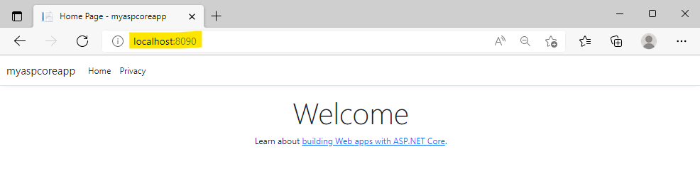

### Congratulations!

You have successfully completed this exercise. Click **Next** to advance to the next exercise.


### Exercise 3: Interaction with a Running Container 

In the previous exercise, you were able to build and run containers based on Dockerfiles. However, there may be situations that warrant interacting with a running container for the purposes of troubleshooting, monitoring etc. You may also want to make changes/updates to a running container and then build a new image based on those changes. In this exercise, you will interact with a running container and then learn to persist your changes as a new image.  


[Return to list of exercises](#table-of-contents)    

#### Interaction with a Running Container

1. On the command line run 

    `docker ps`
    
    to list all the currently running containers on your virtual machine.

    

    >Note:Notice that multiple containers are running. To establish interactive session a with a running container you will need its **CONTAINER ID** or **NAME**. Please note that your **CONTAINER ID** or **NAME** will probably be different. And, unless you specified a name, Docker came up with a random adjective and noun and smushed them together to come up with its own clever name.

1. Let's establish an interactive session to a container based on "**mynodejs**" image.  Type first few characters of the **mynodejs** container id in the textbox bellow: 
   
   **Container ID**
   
    
1. Run a command 

    `docker exec -it <ContainerId2> bash`

    >Knowledge: **docker exec** is used to run a command in a running container. The **it** parameter will invoke an interactive bash shell inside the container. 
  
    >Note:Notice that a new interactive session is now establish to a running container. Since "**bash**" is the program that was asked to be executed you now have access to full bash shell inside the container.

    

1. You can run a command `ls` to view the listing of files and directories. 
    
    >Note: Notice it has all the files copied by Dockerfile command in previous section.

    

    >Knowledge: [Additional information regarding running commands inside docker container](https://docs.docker.com/engine/reference/commandline/exec)

#### Making Changes to a Running Container

While you are interacting and running commands inside a running container, you may also want to make changes/updates to it. Later, you may also create a brand-new image out of these changes. In this task you will make changes to "mynodejs" container image, test them out and finally create a new image (without the need of Dockerfile).

>Note:Please note that this approach of creating container images is generally used to quickly test various changes, but the best practice to create container images is to use a Dockerfile since it is a declarative file that can be kept in source control repositories.

1. First, you will make updates to **server.js** file. You should have an active session already established from previous exercise (if not then please follow the instructions from the previous section to create an active session now).
  
1. Before we can edit the **server.js** file we need to install a text editor. To keep the size of container to a minimum, the **nodejs** container image does not have any extra software installed in the container. This is a common theme when building images and is also the recommend practice.  

1. Before installing any software run the command

    `apt-get update`  
    >Warning:Note the dash between "apt" and "-get".

    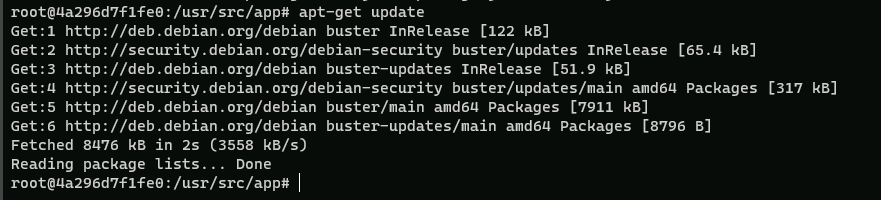

1. To install "**nano**" run a command

    `apt-get install nano`

    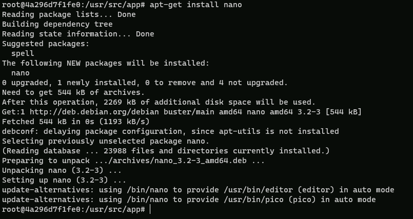

1. After "**nano**" is installed successfully, run the command 

    `nano server.js`
     to open "**server.js**" file for editing.

    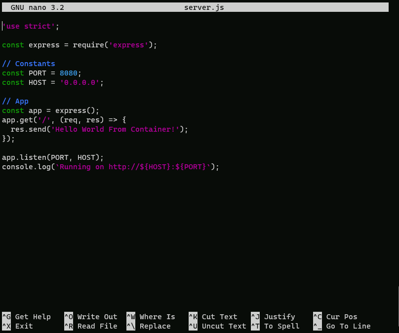

1. Use the arrow keys to go to the line starting with "**res.Send(...**" and update the text from "**Hello World From Container!**" to "**Hello AGAIN!**". 
    
    >Note:Your final changes should look like following:

    

1. Once you finish making changes press "**CTRL + S**" to save the file and then press "**CTRL + X**" to exit. This will close the Nano text editor.

1. To save the updates and exit the interactive bash session, run the command 

    `exit`

    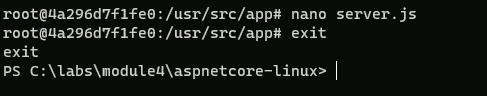

1. The running container needs to be stopped first and then started again to reflect the changes. Run the command 

    `docker stop <ContainerId2>` to stop the container. 
    
1. Run the command 

    `docker start <ContainerId2>` to start the container.

    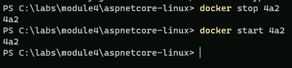

1. Finally, to test the update you have made to the container go to **Microsoft Edge** and **localhost:8080**. 
    
    >Note:Notice the output "**Hello AGAIN!**". This verifies that changes to the container were persisted.

    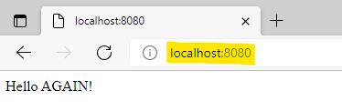  

#### Saving running container to a new image

In the previous task you have made changes to running container. However, these changes are only available to that container and if you were to remove the container, these changes would be lost. 
- One way to address this is by creating a new container image based on running container that has the changes. This way changes will be available as part of a new container image. 
- This is helpful during dev/test phases, where rapid development and testing requires a quick turn-around time.

>Knowledge:This approach is generally **not recommended**, as it's hard to manage and scale at the production level. Also, if content is the only piece that needs to be changed and shared, then using **volumes** may be another viable option. Volumes are covered in module five.

1. To create new image run the command

    `docker commit <ContainerId2> mynodejsv2`

    >Knowledge:The **docker commit** command is used to create a new image from a container's changes.
    
    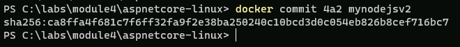

1. Now, view the list of all container images by running the command 

    `docker images`

    >Note:Notice the availability of new image with name "mynodejsv2"

    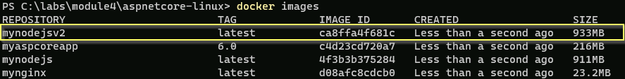

    >Note:You now have a container image with the changes you made and tested earlier and is ready to be used.

1. To test the new image run a command
 
    `docker run -d -p 8081:8080 mynodejsv2`  

    >Note:This will create a new container based on the image "**mynodejsv2**".

    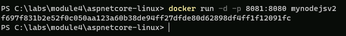

1. Finally, to test the container, go to **localhost:8081** in **Microsoft Edge**.

    >Note:Notice the text "**Hello AGAIN!**" is returned from the node.js application. This attest that changes were committed properly to new image and hence available to any container created based on the that image.

    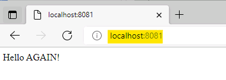

### Exercise 4: Tagging

In this exercise you will learn the role of tagging in container and how to tag new and existing container images using Docker commands.

[Return to list of exercises](#table-of-contents)  

#### Tagging Existing Container Image

- In this task you will tag the **mynodejs** container image with **v1**. Recall from the last task that currently this image has the **latest** tag associated with it. You can simply run `docker images` to verify that. When working with container images it becomes important to provide consistent versioning information.  

>Knowledge: Tagging provides you with the ability to tag container images properly at the time of building a new image using the **docker build -t imagename:tag .** command. You can then refer to the image (for example inside Dockerfile with **FROM** statement) using a format **image-name:tag**.

- If you don't provide a tag, Docker assumes that you meant **latest** and use it as a default tag for the image. It is not good practice to make images without tagging them. You'd think you could assume latest = most recent image version always? Wrong. Latest is just the tag which is applied to an image by default which does not have a tag. If you push a new image with a tag which is neither empty nor 'latest', :latest will not be affected or created. Latest is also easily overwritten by default if you forget to tag something again in the future. **Careful\!\!\!**

1. When you run `docker images` notice the **TAG** column and pay attention to the fact that all of the custom images except .NET 6 app created in the lab so far have tag value of **latest**.

    

- To understand the importance of tagging take a look at the container image created in the previous section **mynodejsv2**.
  - The **v2** at the very end was appended to provide an indicator that this is the second version of the image **mynodejs**. The challenge with this scheme is that there is no inherent connection between the **mynodejs** and **mynodejsv2**.
  - With tagging, the same container image will take the format **mynodejs:v2**. This way you are telling everyone that **v2** is different but has relation to the **mynodejs** container image.  

    >Note: Tags are just strings. So, any string including **v1**, **1.0**, **1.1**, **1.0-beta**, and **banana** all qualify as a valid tag.  

- You should always want to follow consistent nomenclature when using tagging to reflect versioning. This is critical because when you start developing and deploying containers into production, you may want to roll back to previous versions in a consistent manner.
- Not having a well-defined scheme for tagging will make it very difficult particularly when it comes to troubleshooting containers.  

>Knowledge: A good example of various tagging scheme chosen by Microsoft with dotnet core framework is available at: [https://hub.docker.com/r/microsoft/dotnet/tags](https://hub.docker.com/r/microsoft/dotnet/tags)

1. To tag an existing docker image, first run the command to list all the images locally cached, and get the mynodejs Image ID:

    `docker images`

    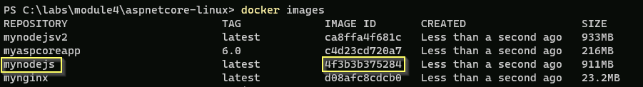

1. In the textbox bellow enter either Image ID **or** simply name of the image - in this case **mynodejs**

    `docker tag <ImageNodeJs> mynodejs:v1`

    >Alert: If you have completed **previous exercises**, image ID will pre-populate in the command above.

1. To see the updated tag for "**mynodejs**" image run the command 

    `docker images`

    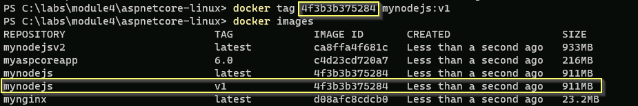

    >Note:Notice how **latest** and **v1** both exist. **v1** is technically newer, and **latest** just signifies the image that did not have a version/tag before and can feel misleading.

    Also, note the Image ID for both are identical. The image and its content / layers are all cached on your machine.

    The Image ID is content addressable, so the full content of it is hashed through a hashing algorithm and it spits out an ID.

    If the content of any two (or more) images are the same, then the Image ID will be the same, and only one copy of the actual layers are on your machine and pointed to by many different image names/tags.

#### Tagging New Container Image

[Return to list of exercises](#table-of-contents)

Tagging a new image is done at the time when you build a container image. it's a straightforward process that requires you to simply add the **:tag** at the end of container image name.

1. Navigate to the directory **"labs/module4/nginx"** that contains the "**nginx**" files along with Dockerfile. You can use the command

     `cd c:\labs\module4\nginx`

1. Build a new image by running the command  

    `docker build -t nginxsample:v1 .`
    >Note:In this case you're creating a new image based on Dockerfile (covered in earlier exercise on NGINX).

    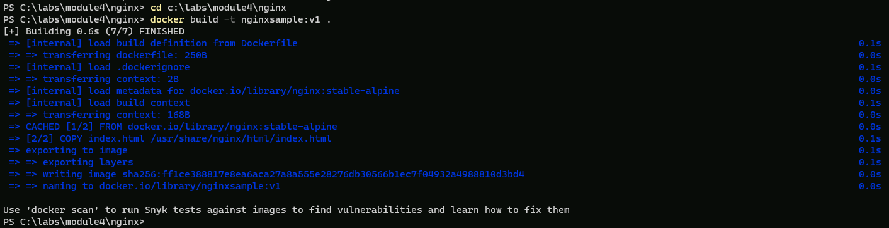

1. Run a command to list all the images

    `docker images`

    >Note: Notice, there is the new container image with tag "**v1**"

    

### Exercise 5: Building and Running SQL Server 2019 in a Container 

 Microsoft SQL Server is one of the most commonly used database server in the market today. Microsoft has made an investment to ensure that customers moving towards containers have an ability to leverage SQL Server through a container image.  

SQL Server 2019 is only available for Linux Containers and allow users to bring their own license key when starting the container. 

[**SQL Server 2019 - Docker Hub Repo**](https://hub.docker.com/_/microsoft-mssql-server)

 In this lab, you will work with Microsoft SQL Server 2019 container image to run a custom database that can store user related information.

- You will first learn how to associate relevant SQL Server database files to SQL Server container image and how to initialize the database with test data.
- Then, you will connect a Web Application packaged in another container to the database running inside the SQL Server container. In other words, you will end up with a web application running in a container talking to a database hosted in another container.
- This is very common scenario, so understanding how it works is important. Let's start by running a SQL Server Express container with the custom database.  

#### SQL Server 2019 Container Image

1. Make sure you have a Windows Terminal opened, and navigate to **SqlServer2019** directory by using the command

    `cd c:\labs\module4\sqlserver2019`

1. Before proceeding further, let's remove all the containers from previous tasks. Run the command

    `docker rm $(docker ps -aq) -f`

1. Look at the **Dockerfile** describing how to package the database

    `code Dockerfile`

    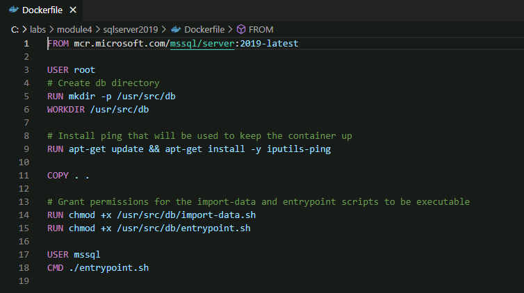

 From the Microsoft SQL Server image, we copy the local files to the container. These local files are composed of:

1. **Users.csv** - contains the test data

    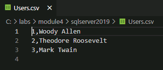

1. **setup.sql** - the SQL commands to create a database named **LabData** and the **Users** table

    

1. **entrypoint.sh** - used as an entry point in the **Dockerfile**. It will start the database server and ru**import-data.sh**

    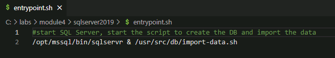

1. **import-data.sh** - will wait for the server to start and will trigger the database creation, the data import and the ***ping*** command to keep the database alive.

    
    >Note:Feel free to look at each file we just described to have a better understanding of their role.

1. Run the command to build our SQL Server container image

    `docker build -t mysqlserver .`

    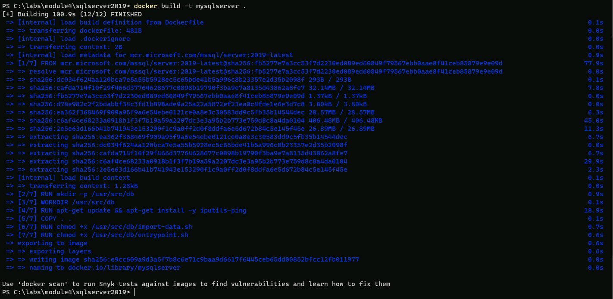

1. Once built, run the start your with the following command
    >Note:Note that we explicitly name our container

    `docker run -e ACCEPT_EULA=Y -e SA_PASSWORD=P@ssw0rd123! -d -p 1433:1433 --name mydb mysqlserver`  

    >Note: The docker run command has various parameters. The following table provides a description for parameters specific to SQL server. See the the [docker hub](https://hub.docker.com/_/microsoft-mssql-server) for an exhaustive list of parameters.

    <table>
    <thead>
    <tr class="header">
    <th>Parameter</th>
    <th>Description</th>
    </tr>
    </thead>
    <tbody>
    <tr class="odd">
    <td>SA_PASSWORD</td>
    <td>The system administrator (userid = 'sa') password used to connect to SQL Server once the container is running. The password in this case is provided in plain text for brevity. However, best practice is to use secrets in Docker: <a href="https://docs.docker.com/engine/reference/commandline/secret">https://docs.docker.com/engine/reference/commandline/secret</a></td>
    </tr>
    <tr class="even">
    <td>ACCEPT_EULA</td>
    <td>Confirms acceptance of the end user licensing agreement found <a href="http://go.microsoft.com/fwlink/?LinkId=746388">here</a>.</td>
    </tr>
    <tr class="odd">
    <td>-e</td>
    <td>Flag that is used to pass environment variables to the container. In this particular case password and license eula are passed as environment variable.</td>
    </tr>
    </tbody>
    </table>  

    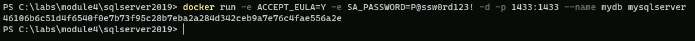

1. You can follow the database initialization with the command 

    `docker logs mydb -f`

    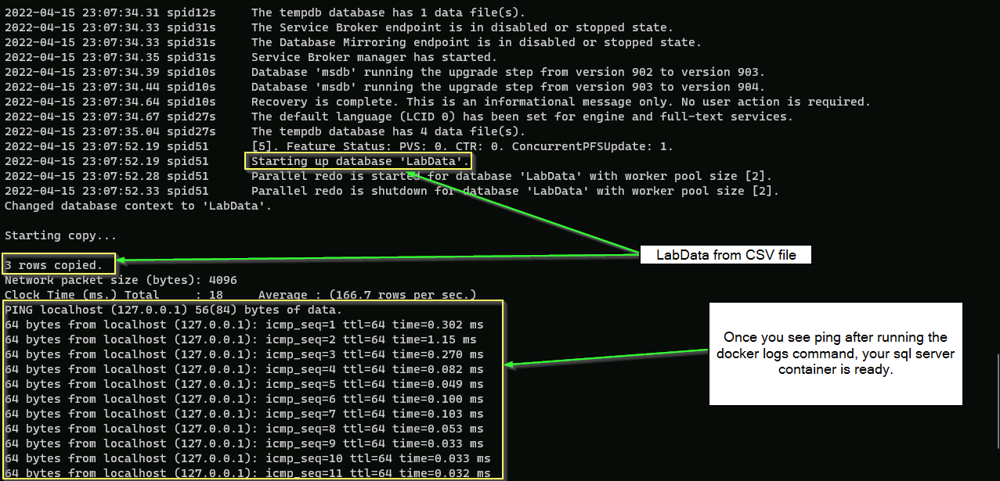

1. Once you see the ***ping*** command starting. Once it started, you can interrupt ***docker logs*** by hitting ***CTRL + C***

    >Note: **LabData** is listed as a new database and that we imported 3 rows (coming from **Users.csv**).  

1. Run the following command to open an interactive session within the database container with **sqlcmd**.

    >Knowledge:**Sqlcmd** is a basic command-line utility provided by Microsoft [https://docs.microsoft.com/en-us/sql/relationaldatabases/scripting/sqlcmd-use-the-utility](https://docs.microsoft.com/en-us/sql/relationaldatabases/scripting/sqlcmd-use-the-utility) for ad hoc, interactive execution of Transact-SQL statements and scripts  


    `docker exec -it mydb /opt/mssql-tools/bin/sqlcmd -S localhost -U sa -P P@ssw0rd123!`  

    

1. Let's begin by listing down all the databases available by running the command  
    ```
    SELECT name FROM master.dbo.sysdatabases
    GO

    ```  
    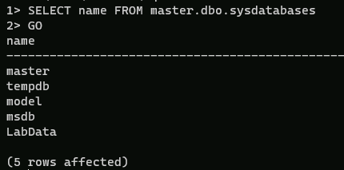  

    >Note: **LabData** is listed at the very bottom.   

1. Now let's check that the users we had in **Users.csv** have been properly ingested into the database  at initialization

```sql
USE LabData  
SELECT * FROM Users  
GO
```

    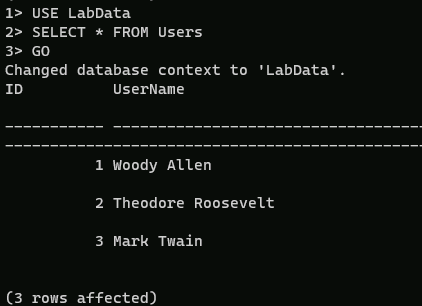

1. Now let's exit the **sqlcmd** session. Note that the database will still be running in the background

    `exit`

#### Connect Application to the SQL Server Container
 
1. Now we will connect an ASP .NET Core Application to our SQL Server and show that it can see the data stored in the database. Change the current directory to ASP .NET Web Application by using the command  

    `cd c:\labs\module4\aspnetcorewithsqlserver`

1. First, we need to know what is the IP address of the container running the SQL Server so that the front end web application.

    Run the following command:

    `docker inspect mydb | findstr "IPAddress"`

    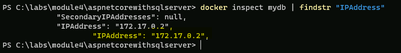

    >Alert:**Copy the IP Address as you will need it for the next task.**

1. Now we need to update the connection string used by the web app to connect to the SQL Server back end. Connection string is hardcoded in the **Program.cs** file.
    >Knowledge:Note, that is not the best practice to hardcode the connection string in the Program.cs file.  This is done for the simplicity of the lab.

1. Run the following command to open **Program.cs** in Visual Studio Code:

    `code Program.cs`

    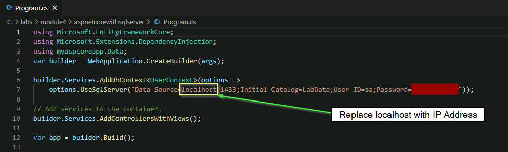

1. Inside the **Program.cs** file, replace **localhost** in the connection string with the IP address you just copied.  **Save** the file and **close** Visual Studio Code.

1. We are now ready to build the ASP .NET Core Web Application.  
    >Note:Make sure you are in **c:\labs\module4\aspnetcorewithsqlserver** folder  

    `dotnet build`   
    
    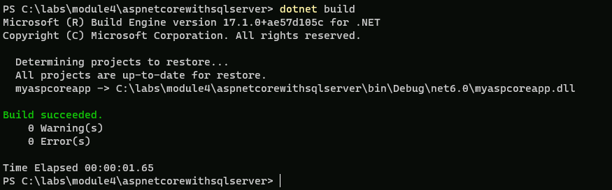

1. Then publish the artifacts in a **published** folder with

    `dotnet publish -o published`    
    
    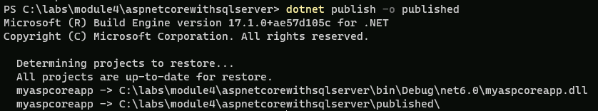

1. Now, we are ready to build our container that we will tag with an explicit **withsql** string

    `docker build -t myaspcoreapp:6.0-withsql .`

    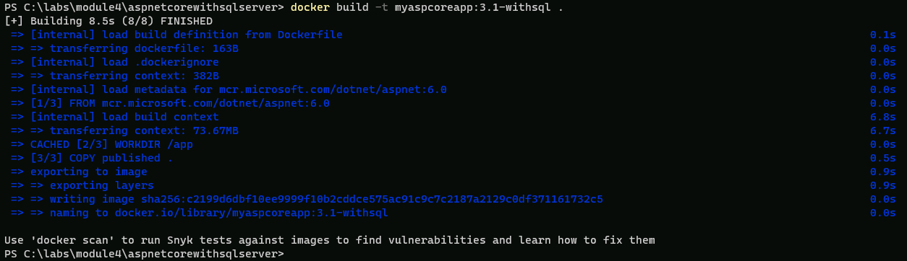  

1. Finally, run the container  and expose the web app on port **8082** 

    `docker run -d -p 8082:80 myaspcoreapp:6.0-withsql`

    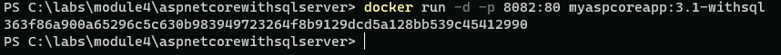  

1. Open a browser and naviguate to **localhost:8082**. Navigate to Users tab.

    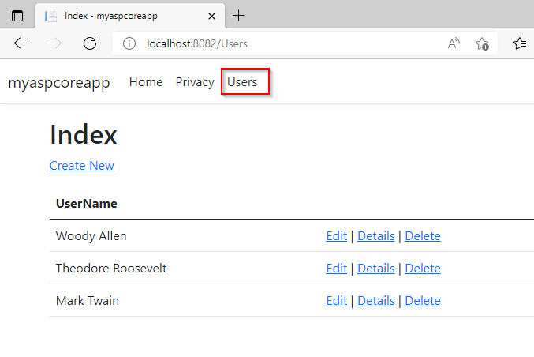

1. Click on **Create New Users** and add a new user (e.g. John Doe).  
    
    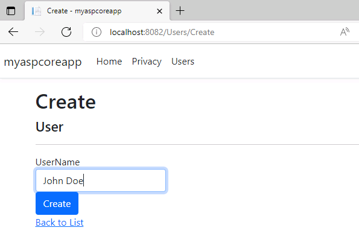

    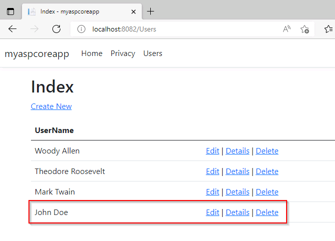

    >Note: You could remove the front end container and re-run it, you would still see the new user that you have created since it is stored in the SQL Server container.   

1. We have reached the end of the lab, let's remove all the containers to leave the environment in a clean state. Run the command 

    `docker rm $(docker ps -aq) -f`  

1. We are done with the **Linux Containers** and in the next Exercise we will be moving on to **Windows Containers**.  

### Exercise 6: Working with Nano Server and Windows Server Core containers

In this exercise, you will learn about the Windows Nano Server and Server Core images. Please read below for an overview of each image. Then you will complete the steps to build and run these containers.

[Return to list of exercises](#table-of-contents)

>Alert: **IMPORTANT**: Following three exercises will focus on Windows Containers.  To work with Windows Containers we have to change tell Docker to point to the Windows.  Steps bellow must be completed before continuing with the exercises.

1. Locate Docker Icon in your Taskbar

    >Note:You might have to click on the ^ icon first to get to Docker Icon

    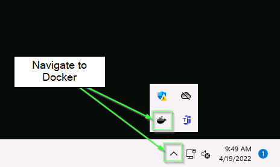

1. Right click on Docker Icon and click on **Switch to Windows Containers**.

    

    >Alert: You might get a message that existing linux containers will continue to run, click the switch button to move on. If you did not get a message ignore this step.


1. It might take few minutes for switch to complete and you will see the Docker Icon moving at the moment.  Once the Docker Icon stops moving, navigate to Powershell and type following to validate that you switched.

    `docker version`

    

1. That's it, you are now ready to move on to the exercises.

#### Windows Server Core Overview

The Server Core option is a minimal installation option that is available when you are deploying the Standard or Datacenter edition of Windows Server. Server Core includes most but not all server roles. Server Core has a smaller disk footprint, and therefore a smaller attack surface due to a smaller code base.

It is recommended that you choose the Server Core installation unless you have a need for the additional user interface elements and graphical management tools that are included in the Server with Desktop Experience option. For an even more lightweight option, see the next section on Nano Server. Server Core allows you to install various Server roles that may not be available in Nano Server including those listed below:

>Knowledge:

- Active Directory Certificate Services
- Active Directory Domain Services
- Active Directory Federation Services
- Active Directory Lightweight Directory Services
- Active Directory Rights Management Services
- Device Health Attestation
- DHCP Server
- DNS Server
- File and Storage Services
- Hyper-V
- Print and Document Services
- Streaming Media Services
- Web Server (including a subset of ASP.NET)
- Windows Server Update Server
- Active Directory Rights Management Server
- Routing and Remote Access Server and the following sub-roles:
- Remote Desktop Services Connection Broker
- Licensing
- Virtualization
- Volume Activation Services

For a comprehensive list of features available in Server Core click [here](https://docs.microsoft.com/en-us/windows-server/administration/server-core/server-core-roles-and-services#features-included-in-server-core).

#### Windows Nano Server Overview

Nano Server is optimized as a lightweight operating system for running "cloud-native" applications based on containers and micro-services. There are important differences in Nano Server versus Server Core. As of Windows Server 2016, version 1803, Nano Server is available only as a container base OS image. You must run it as a container in a container host, such as a Server Core installation of Windows Server. Running a container based on Nano Server in this release differs from releases prior to 1803 in the ways listed below:

- Nano Server has been optimized for .NET Core applications
- Nano Server size has been optimized in Windows Server 2019 version
- PowerShell Core, .NET Core, and WMI are no longer included by default as they were in Windows Server 2016, but you can include PowerShell Core and .NET Core container packages when building your container
- There is no longer a servicing stack included in Nano Server. Microsoft publishes an updated Nano image to Docker Hub that you redeploy
- You troubleshoot the new Nano Container by using Docker
- You can now run Nano containers on IoT Core

For a comprehensive list of capability differences between Nano Server and Server Core, visit [https://docs.microsoft.com/en-us/windows-server/get-started/getting-started-with-nano-server](https://docs.microsoft.com/en-us/windows-server/get-started/getting-started-with-nano-server))

Microsoft hosts base OS images in Microsoft Container Registry (MCR), and they are fully searchable and available through Docker Hub. In the following exercise, you will run a  basic "hello world" container leveraging both the Nano and Server Core images.

#### Run a container based on the Nano Server base image

1. Oper your Windows Terminal, in the case you closed it earlier and run the following command to view your images:

    `docker images`

    

1. Notice that you already have **Server Core** and **Nano Server** images locally cached on your Virtual Machine.  

    >Knowledge: It's important to understand that you can always download specific version of **windows/servercore** and **windows/nanoserver** images by using an appropriate tag. For example, `docker pull mcr.microsoft.com/windows/servercore:10.0.17763.437` will pull the server core image that has a version number 10.0.17763.431. Notice the [mcr.microsoft.com](https://azure.microsoft.com/en-us/blog/microsoft-syndicates-container-catalog/) registry that is the container registry hosted on Microsoft servers, even though the images are discoverable on Docker Hub. All the concepts you learned about docker (Linux) containers and images generally apply as-is to windows containers too. The main deference is the fact that windows containers require the windows operating system as a host, while the Linux containers require Linux operating system.  

1. You will now run a container based on **Server Core** image (**mcr.microsoft.com/windows/servercore**). Before you do that, run the command

    `hostname`

    This will reveal the hostname of your virtual machine.
    >Note:Please note that your host machine name may be different.

    

1. Run the command

    `docker run -it mcr.microsoft.com/windows/servercore:20H2 powershell`

    Please be patient as it will take a minute or so for this command to work.

    - The **-it** switch provides you with an interactive session.
    - The **powershell** is a parameter passed as an argument which basically gives you access to Powershell (command line) running inside the container.

    Technically, the **-it** switch puts you inside a running container.  

    

1. Run the command

    `hostname`

    This time you are running it inside the running container.
    >Note:Notice that the host name is different from the host name you get in step 1. The host name you see inside the container is the host name of the container itself. It is based on the container ID. You may want to run other commands as you wish or checkout the filesystem that is independent from the host's filesystem.

    

1. Finally, exit the interactive session by typing

    `exit`

    This will take you back to the PowerShell console on the host.  

    

1. Now let's run another container based on **Nano Server** image (**mcr.microsoft.com/windows/nanoserver**). To do that run the command

    `docker run -it mcr.microsoft.com/windows/nanoserver:20H2 CMD`

    >Hint:It might take a few seconds to load. This time we are starting a Windows Command prompt instead of Powershell inside of the container)  
 
     

1. Run the command 

    `hostname`
    
    Notice that the host name is different from host name you get in the previous steps. Again, the host name you see inside the container is the host name of the container itself, which is based on the container id. You can run other commands as you wish.

    
    
1. Finally, exit the interactive session by typing 

    `exit` 
    
    This will take you back to the PowerShell console on the host.  

    

### Exercise 7: Build and run an IIS Server Image

In the exercise you will learn how to install IIS Web Server (Web Server Role) on a Windows Server Core base core image. IIS Server is a popular Web Server released by Microsoft. Considering the strong footprint of IIS within enterprises, Microsoft supports IIS on Windows Server Core.

[Return to list of exercises](#table-of-contents)

#### Build and run an IIS Server Image

1. Make sure you have a Windows Terminal and change the current directory to "**iis**" by running the command 

    `cd c:\labs\module4\iis`

1. Run command to list all the files in directory

    `ls`

    

1. The iis folder contains the Dockerfile with instructions to install IIS Server (Web Server Role) on the Windows Server Core base image. Display the Dockerfile in Visual Studio code by running the command 

    `code .\Dockerfile`

    

    - The **FROM** instruction points to the **mcr.microsoft.com/windows/servercore** to be used as a base image for the new container image
    - The **RUN** instruction executes PowerShell to install Windows Feature "Web Server" (IIS Server)
    - The next command is the **ADD** instruction which copies the **ServiceMonitor.exe** utility to the container image. The **ServiceMonitor.exe** is a utility that monitors **w3svc** service inside the container, if the service fails, the exe fails, so Docker knows the container is unhealthy. 
        
        >Hint:The **ServiceMonitor.exe** is developed and released by Microsoft (<https://github.com/microsoft/iis-docker/tree/master/windowsservercore-ltsc2019)>
    
    - The **EXPOSE** instruction does not actually publish the port. It functions as a type of documentation between the person who builds the image and the person who runs the container, about which ports are intended to be published.    
    - The **ENTRYPOINT** instruction makes sure that monitoring of **w3svc** begins immediately as soon as container starts running. This is what will keep the container in running state. 

1. Close the Visual Studio code.

1. To build the new image with IIS installed on it, run the command 

    `docker build -t myiis:v1 .` 
    
    This command builds a new container image with name **myiis** and tag **v1**. The tag conveniently tells everyone information pertaining to the version of the image. 
    >Alert: **STEP 2/6** of the build process performs the installation of the Web-Server (IIS Server) and may take few minutes. Eventually you should see the results as follow. 

    

1. Run a new container based on **myiis:v1** image by using the command: 

    `docker run -d -p 8099:80 myiis:v1`

    

1. The full container ID is shown after the run command (**de2** in the above screenshot), or can be obtained by using 

    `docker ps`

1. To open up your container in browser, run the following command:

    `start http://localhost:8099`
 
    

    >Note: You can get the container's IP address of the container with **docker inspect** command as follow: **docker inspect --format '{{ .NetworkSettings.Networks.nat.IPAddress}} ' containerid **. When accessing the container using it's IP Address you would use the port the container is listening on (port 80 in this case)

### Exercise 8: Building an ASP.NET 6 application

In the previous task, you built container images using some of the more mature technologies and products released by Microsoft. In this task,
you will build container that will run ASP.NET Web Application using .NET 6.0. If you completed the Exercise 2 in this Module, this will be very similar. However, we will now build the aspnet application on **Windows** instead of **Linux**.

Furthermore, we will use the **multi-stage** build process rather than building the application manually with **dotnet** CLI.  

In this exercise, you will package a simple ASP.NET MVC application into a container image using a **Dockerfile**. Finally, you will run container hosting the ASP.NET Core application using the **docker run** command.

[Return to list of exercises](#table-of-contents)

#### Building and Running ASP.NET 6.0 Application Inside Container

1. Change to the relevant directory using the following command:

    `cd C:\labs\module4\aspnet-win`  

    

1. You are provided with a Dockerfile. View the content of the Dockerfile in Visual Studio Code by running the command

    `code .\Dockerfile`

    The Dockerfile should look like the one below
    >Note: This is a multi-stage Dockerfile

    

1. Close the Visual Studio Code.

1. To create the container image run the command

    `docker build -t aspnetapp:6.0 .`

    >Note: Notice the use of tag **6.0** that signifies the dotnet 6.0 framework version

1. Launch the container running the app inside it by running the command

    `docker run -d -p 9000:80 aspnetapp:6.0`

    

1. You are now running ASP.NET Web application inside the container listening on the port 80 which is mapped to port 9000 on the host.

1. To see the ASP.NET Web application in action open the web browser and navigate to **localhost** port **9000**

    `start http://localhost:9000`

    This will take you to the Home page of the Web Application.  

    

1. Run the following command to stop and remove all containers:

    `docker rm (docker ps -aq) -f`
